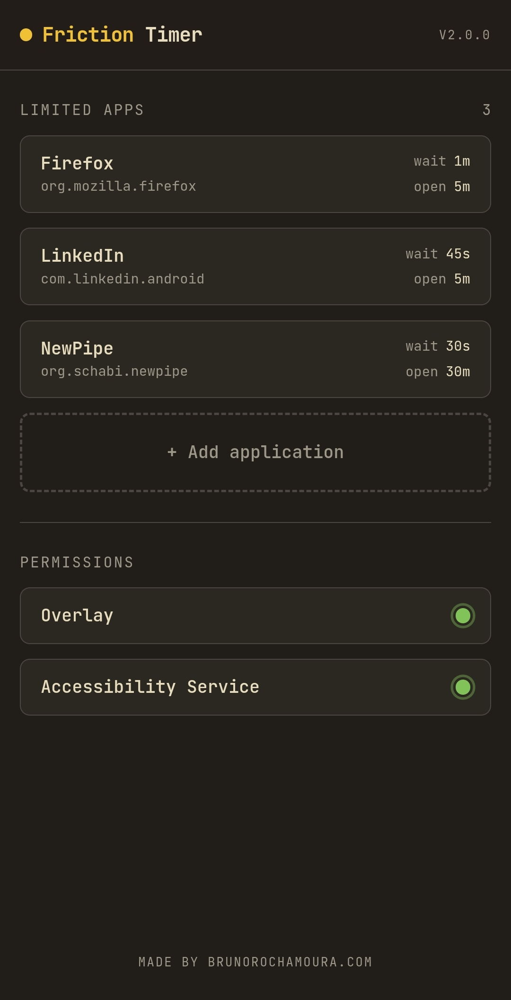
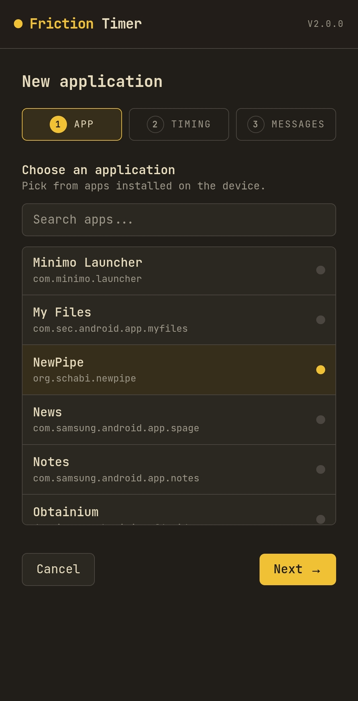
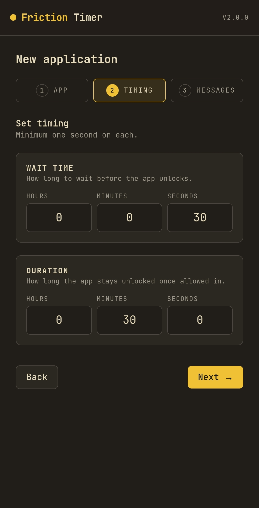
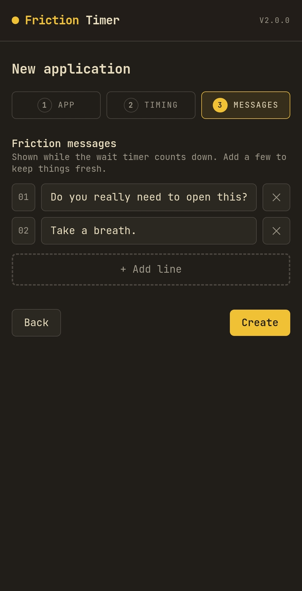

<div align="center">
  <h1>🚫 Friction Timer ⏳</h1>
  <p><i>Made by <a href="https://www.brunorochamoura.com/about/">BRM</a>.</i></p>
  <br />
</div>

Friction Timer is an Android app that adds a waiting period before you can use selected apps.

When you open an app you have added to the list, Friction Timer shows an overlay on top of it and starts a countdown. You can wait for the timer to finish or cancel and back out. The point is simple: make impulsive opens slower.

## What it does

- Adds friction before you can use selected apps
- Lets you choose a different wait time for each app
- Lets you set a cooldown before the overlay appears again
- Shows your own messages on the overlay while the timer runs

## Screenshots

<div align="center" style="display: flex; justify-content: space-around;">
  
  
  
  
</div>

## Download

Download the latest APK from the [Releases](https://github.com/BrunoRochaDev/FrictionTimer/releases) page.

## Build it yourself

This project is set up for Android with Tauri 2.

### Prerequisites

- Node.js and `pnpm`
- Rust stable via `rustup`
- Android SDK and an emulator or USB-connected device

Install the Rust Android targets once:

```bash
rustup target add aarch64-linux-android armv7-linux-androideabi i686-linux-android x86_64-linux-android
```

### Build from the command line

Install dependencies:

```bash
pnpm install
```

Run the app on a connected Android device or emulator:

```bash
pnpm tauri android dev
```

Create a release build:

```bash
pnpm tauri android build
```

Generated APKs are placed under `src-tauri/gen/android/app/build/outputs/apk/`.

### Release signing

Signed release builds use the local file `src-tauri/gen/android/keystore.properties`, which is ignored by git.

For a signed release, point it at a valid keystore:

```properties
storeFile=/absolute/path/to/android.jks
storePassword=...
keyAlias=...
keyPassword=...
```

If that file is missing or the `storeFile` path does not exist, the Android build falls back to an unsigned release artifact instead of failing.

## How it works

1. Friction Timer uses an `AccessibilityService` to detect when a selected app moves to the foreground.
2. It shows an overlay that blocks interaction until the countdown finishes.
3. The overlay includes:
   - a message from your configured list
   - a disabled button that counts down and later changes to "Proceed"
   - a "Cancel" button
4. After you proceed, the overlay can appear again the next time that app opens once its cooldown has expired.
5. Each app can have its own wait time, cooldown, and messages.

## Credits

Thanks to [digipaws](https://github.com/nethical6/digipaws) for the inspiration. Their source code served as a reference for the implementation of this app.

## License

This project is distributed under the AGPLv3 License. See the [LICENSE](https://github.com/BrunoRochaDev/FrictionTimer/blob/main/LICENSE) file for details.
